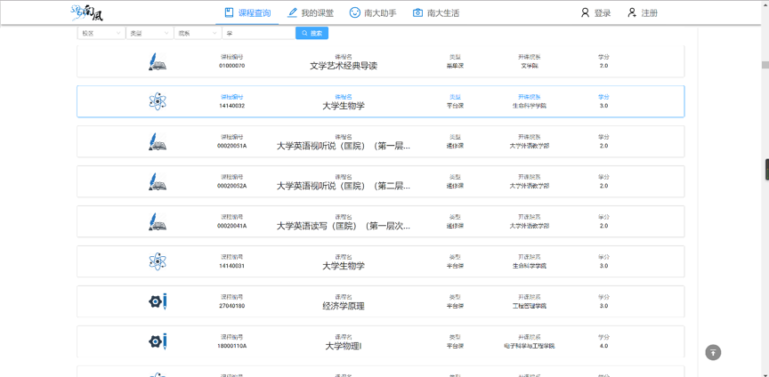
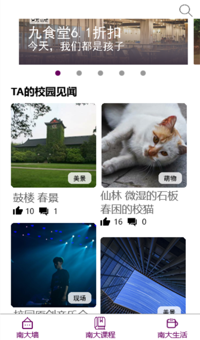

 

  
  <h3 align="center">南风</h3>
  

    校园服务App
     
    <a href="https://github.com/Scientific-Mushrooms/NanFeng-mobile"><strong>Mobile</strong></a> ·
    <a href="https://github.com/Scientific-Mushrooms/NanFeng-server"><strong>Server</strong></a> ·
    <a href="https://github.com/Scientific-Mushrooms/NanFeng"><strong>Web</strong></a>
     
     
  

## 目录

- [目录](#%e7%9b%ae%e5%bd%95)
- [项目介绍](#%e9%a1%b9%e7%9b%ae%e4%bb%8b%e7%bb%8d)
- [项目设计](#%e9%a1%b9%e7%9b%ae%e8%ae%be%e8%ae%a1)

<!-- ABOUT THE PROJECT -->
## 项目介绍

现今社会进入信息高速发展的移动互联网时代，同学们的校园学习与生活也高度依赖网络信息。然而，南大同学们现在常用的信息平台却存在一些问题。例如，常用于查询课程信息与评价的米课网(micourse.net）就存在课程信息落后，功能单一等问题，而另一校园信息服务平台南京大学表白墙，则承担了过多的信息职能，同学查找特定信息困难，以QQ空间为载体的设计也给诸如失物招领等功能带来局限

南风开发团队从“研究探讨解决现实问题，对接社会实际需求”这一点出发，结合立项前对校内同学的调研及自身的感受，将实践主题确定为开发一款校园信息服务平台，用以填补现有第三方校园服务平台的不足。

## 项目设计
项目计划为网页和移动端多平台同时开发。

主要实现功能分为三个板块：

作为核心的课程板块“知课”，主要服务同学们对课程查询的需要，包含鼓楼和仙林两个校区的课程，设有课程讨论区供同学交流分享学习经验，另外能为使用南风的教师用户开放权限，更加方便地发布课程通知或是课堂练习。

校园信息发布板块“知意”，包含诸如失物招领，二手转卖，匿名询问问题等等，分类开设专栏，这样能够使这些服务更有效率。

校园社交板块“知趣”，用于一些校园活动的发布，校园见闻的分享。

软件及网页端部分截图如下：

网页端课程查询的页面输入“学”进行查询

手机端的运行截图（分别为知意与知趣板块，内容均为测试发布）

    
    

